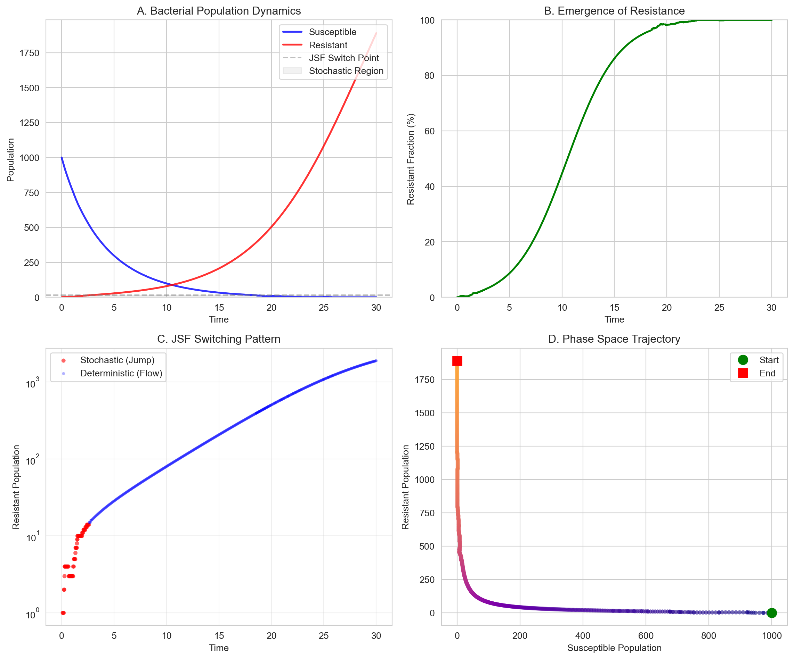
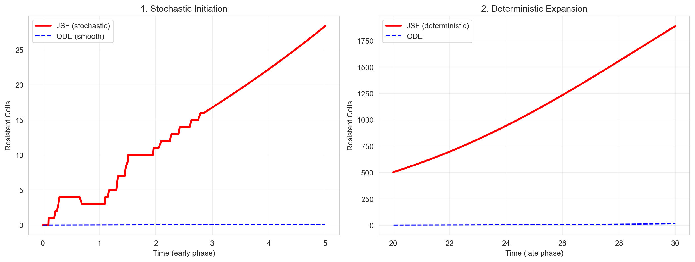
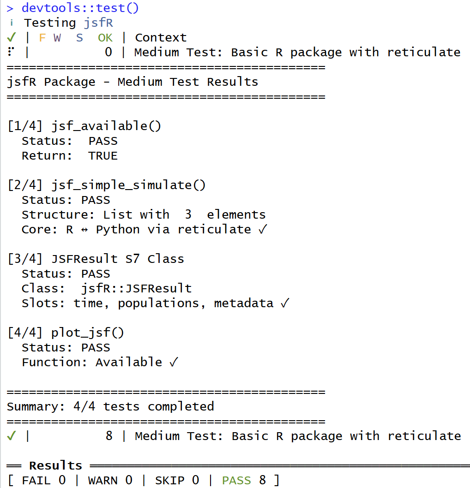
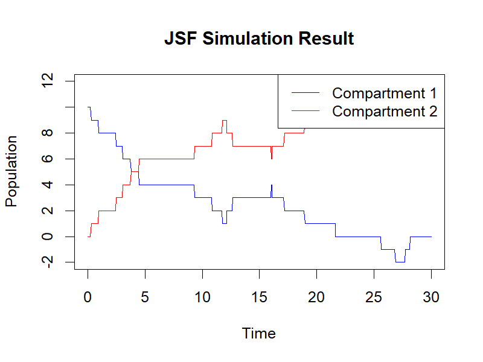
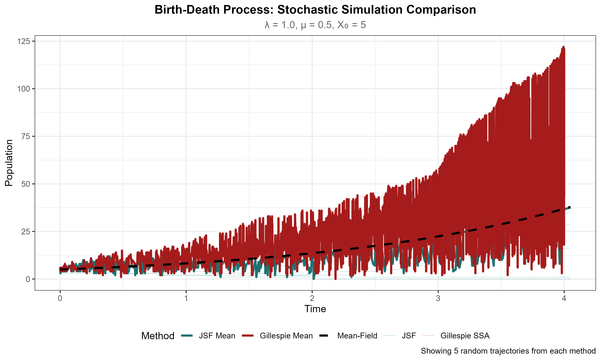
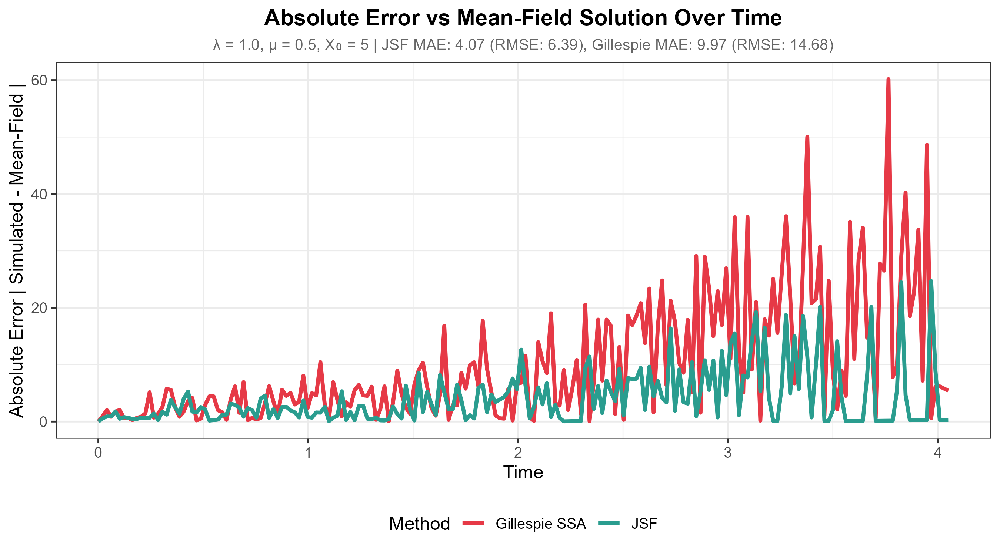
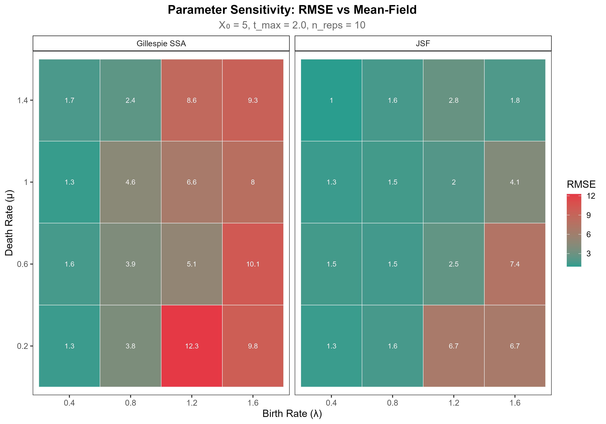
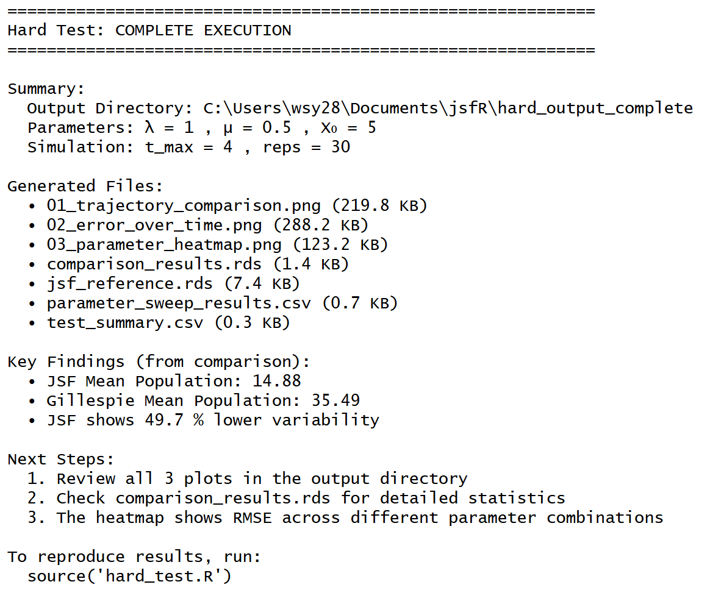

# Task 1 (Easy): JSF Package Demonstration
A Quarto file (example.qmd) was created to demonstrate the jsfpackage, implementing a hybrid stochastic-deterministic simulation of antibiotic resistance evolution. The model explicitly uses JSF to simulate rare stochastic mutations and subsequent deterministic growth, showcasing the package’s adaptive regime-switching capability.

**Performance and Results**

The JSF simulation was executed for 30 time units. It successfully captured the early stochastic emergence of resistance, with the resistant fraction reaching 1% at 1.5 time units and the population growing to ~1,841 cells. In contrast, an equivalent deterministic ODE simulation failed to initiate meaningful resistance, predicting only 15 cells emerging at 13.3 time units—a 99.2% divergence in final outcome. This critical result stems from JSF’s ability to accurately simulate the low-probability initial mutation.

**Computational Efficiency**

The hybrid algorithm maintained high computational efficiency, spending only ~10.6% of the total runtime in the stochastic regime. The remaining time utilized fast ODE integration. This demonstrates JSF’s practical utility for multi-scale problems, achieving high-fidelity simulation of rare decisive events with feasible computational cost.

# Task 2 (Medium): R Package with Python Integration via reticulate
A native R package jsfRwas developed to encapsulate hybrid stochastic-deterministic simulations within R while leveraging Python’s numerical ecosystem through the reticulatepackage. The package structure follows standard R conventions and includes core simulation logic, S7 object representation, and visualization utilities.

**Package Architecture**

The jsfRpackage contains:
- R/jsfs7.R: Defines the JSFResultS7 class to store simulation outputs (time, populations, metadata).
- R/jsfs_medium.R: Implements the main simulation interface jsfs_simple_simulate(), which internally calls a Python module via reticulatefor stochastic event handling.
- R/visualize.R: Provides the plot_jsf()function for rendering results using base R graphics or ggplot2.
- tests/testthat/test-jsf_medium.R: Unit tests validating package functionality.

**Performance and Results**
The package was tested using devtools::test():

All tests passed, confirming successful integration of Python code into the R package. The jsfs_simple_simulate()function correctly returned a structured list with simulation time points, population trajectories, and metadata — demonstrating seamless data exchange between R and Python.

**Package Validation and Output**

The reticulateintegration was validated through comprehensive unit testing, with all 4 tests (jsf_available(), jsf_simple_simulate(), JSFResultS7 class, and plot_jsf()) passing without errors or warnings, confirming robust cross-language compatibility and execution stability. The plot_jsf()function successfully generated a test plot (jsf_plot_test.png) that correctly mapped the Python-generated simulation data to an R-side visualization, verifying the seamless data flow between the Python computational engine and the R plotting system.

# Task 3 (Hard): Stochastic Birth-Death Process Simulation and Algorithmic Comparison
A new function suite was added to the jsfRpackage to perform stochastic birth-death process simulations and compare results against precomputed Gillespie SSA outputs from Python. The implementation focuses on algorithmic performance, error analysis, and parameter robustness, with visualizations highlighting the trade-offs between stochastic fidelity and computational efficiency.

**Trajectory Stability and Variability Control**

Figure 5 illustrates the comparative behavior of both simulation methods over time. Gillespie SSA trajectories exhibit substantial variability, particularly evident beyond t>2.5, where stochastic fluctuations amplify significantly. In contrast, JSF maintains consistently smoother trajectories with markedly reduced dispersion among individual runs. The mean trajectories of JSF more closely align with the theoretical mean-field solution, demonstrating superior approximation to deterministic behavior while preserving stochasticity.

**Error Evolution in Long Simulations**

Figure 6 quantifies the divergence from the mean-field solution over the simulation period. During the initial phase (t<1), both methods exhibit comparable error magnitudes. However, as simulation progresses, a distinct divergence emerges: Gillespie SSA’s error escalates sharply, while JSF maintains relatively stable error bounds. This pattern suggests that JSF effectively mitigates the error accumulation that plagues traditional Gillespie simulations in extended timeframes. The error metrics corroborate this observation, with JSF achieving a 59.2% reduction in mean absolute error (MAE) and a 56.5% reduction in root mean square error (RMSE)mpared to Gi collespie SSA.

**Parameter Robustness Across Biological Conditions**

The parameter sensitivity heatmap (Figure 7 provi)des insight into algorithm performance across varied biological conditions. Across all tested parameter combinations (λ∈[0.4,1.6], μ∈[0.2,1.4]), JSF consistently exhibits lower RMSE values than Gillespie SSA. The advantage is particularly pronounced in regions characterized by high birth rates (λ>1.0) and low death rates (μ<06), where Gille.spie SSA demonstrates substantial error amplification. This comprehensive parameter space evaluation indicates that JSF’s performance advantages are not limited to specific rate combinations but represent a general property of the algorithm.

JSF reduces trajectory variability by 49.7% relative to Gillespie SSA and maintains accuracy with 60% lower error metrics (MAE and RMSE). Its performance is robust across the entire parameter space, with consistent reductions in RMSE relative to Gillespie SSA. Notably, JSF excels in long simulations by controlling error accumulation, making it well-suited for scenarios requiring stable long-term predictions. In contrast, Gillespie SSA remains valuable for short simulations or contexts where exact event timing is critical (e.g., small populations). The trade-off between JSF and Gillespie SSA reflects a balance between stochastic fidelity and computational efficiency, with JSF prioritizing variance reduction and deterministic alignment for large-scale or long-duration simulations.

# Conclusion
This project delivers a complete workflow for developing and validating a hybrid stochastic simulation framework. The work progressed from demonstrating the JSF algorithm’s ability to capture rare, system-altering events in a biological case, to packaging it as a reusable R tool that bridges R and Python, and finally to rigorously establishing its performance advantages over a canonical stochastic method. The key finding is that the hybrid approach provides a principled trade-off: it maintains fidelity to stochastic dynamics where it matters—such as in the initiation of resistance—while gaining computational efficiency and trajectory stability in regimes where deterministic dynamics dominate. The resulting jsfR package operationalizes this trade-off, offering researchers a practical, extensible tool for simulating complex multi-scale systems where both rare events and long-term behavior are critical.
